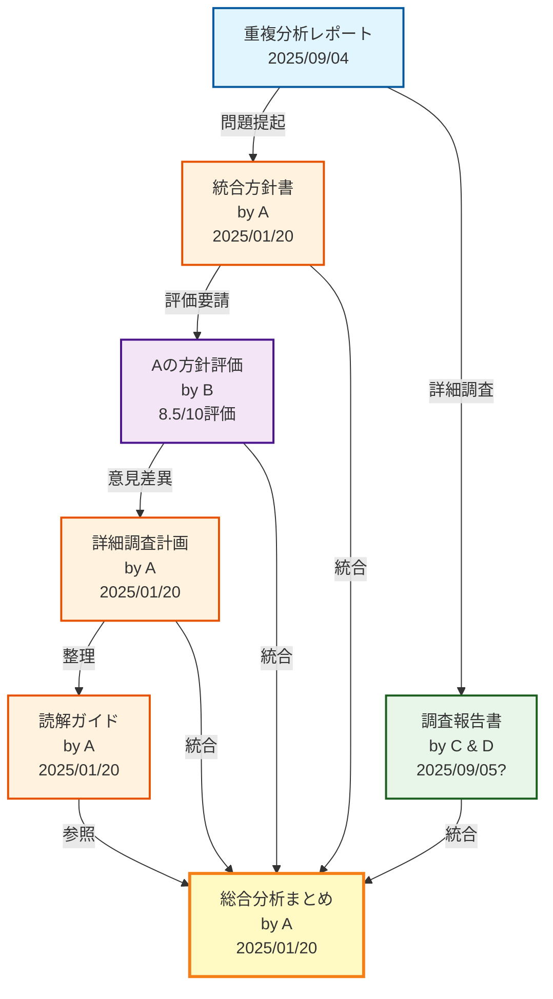

# 📊 ツール統合分析 文書関係図

**作成日**: 2025年1月20日  
**目的**: 各文書間の関係性と、4つのAIエージェントの関与を視覚化

---

## 🗺️ 文書関係マップ



---

## 👥 エージェント別の貢献内容

### A（メインAI Assistant）
```
作成文書：
├─ 統合方針書（1,600行の詳細設計）
├─ 詳細調査計画（意見差異分析）
├─ 読解ガイド（第三者向け）
└─ 総合分析まとめ（本統合文書）

特徴：技術的完璧主義、楽観的、システマチック
```

### B（Aのサブエージェント）
```
評価内容：
└─ 統合方針書への批判的レビュー
    ├─ CI/CD統合の欠落指摘
    ├─ 非決定的出力の問題提起
    └─ 人的要因の重要性強調

特徴：実務的、現実的、組織視点重視
```

### C（調査AIメイン）
```
作成内容：
└─ 包括的調査報告書（前半部分）
    ├─ プロジェクト全体像の把握
    ├─ 統合可能性の技術的評価
    └─ 段階的実施の推奨

特徴：Aと類似の技術楽観主義
```

### D（調査AIのサブ）
```
評価内容：
└─ 調査報告書への批判的視点（後半部分）
    ├─ 1,565ファイルの異常性指摘
    ├─ weight.html非互換性の詳細分析
    └─ 最大4年という現実的期間計算

特徴：最も批判的、現実的、リスク重視
```

---

## 📈 意見の収束過程

```
初期状態：
A ━━━━━━━━━━━━━━━━━━━━━━━━━━━━━━━━> 楽観的
                                      ↑
B ━━━━━━━━━━━━┅┅┅┅┅┅┅┅┅┅┅┅┅┅┅┅┅┅┅┅┅> 中間
                                      ↑
C ━━━━━━━━━━━━━━━━━━━━━━━━━━━━━━━━> 楽観的
                                      ↑
D ┅┅┅┅┅┅┅┅┅┅┅┅┅┅┅┅┅┅┅┅┅┅┅┅┅┅┅┅┅┅┅┅┅> 悲観的

統合後：
全体 ━━━━━━━━━━┅┅┅┅┅┅┅┅┅┅┅┅┅┅┅┅┅━━━━> バランス型
         ↑
     小規模パイロットから開始
```

---

## 🎯 最終的な合意形成

### 完全合意事項
- ✅ ツール重複は問題
- ✅ 安全性最優先
- ✅ 段階的アプローチ必要

### 条件付き合意
- ⚠️ 統合は技術的に可能（ただし期間とリソース次第）
- ⚠️ weight.html問題は深刻（ただし解決不可能ではない）

### 新たな合意
- 🆕 小規模パイロットで検証
- 🆕 既存バグ優先も考慮
- 🆕 3ヶ月ごとの見直し

---

## 📁 文書の物理的配置

```
weight-management-app/
└── handover/
    ├── TOOL_DUPLICATION_ANALYSIS_REPORT_20250904.md
    ├── SAFE_TOOL_INTEGRATION_POLICY_20250120.md
    ├── TOOL_INTEGRATION_DETAILED_INVESTIGATION_20250120.md
    ├── TOOL_INTEGRATION_READING_GUIDE_20250120.md
    ├── WEIGHT_MANAGEMENT_APP_INVESTIGATION_REPORT_20250905.md
    └── tool-integration-analysis/  ← 📌 統合フォルダ
        ├── COMPREHENSIVE_ANALYSIS_SUMMARY_20250120.md
        └── DOCUMENT_RELATIONSHIP_DIAGRAM.md（本文書）
```

---

**注記**: 日付の不整合（2025/09/05）については、おそらく文書作成時のエラーと思われる。実際の作成日は2025/01/20前後と推定。